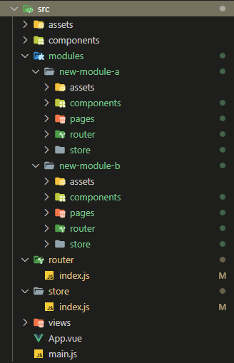
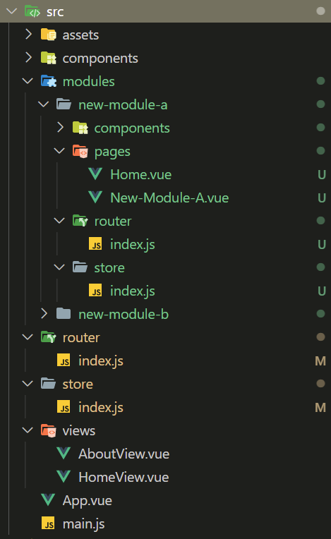
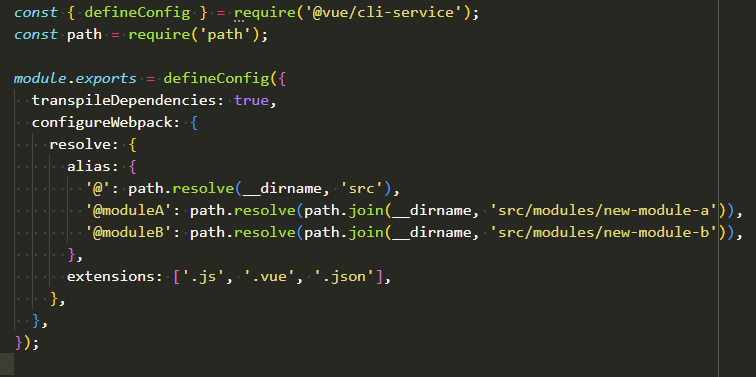

# Vue CLI Plugin para Gerar Novos Módulos
Partindo do pressuposto que você já tenha um projeto criado a partir do vue-cli, com o vue-router e o vuex instalado, esse plugin te ajudará com a modularização do seu projeto.

A ideia desse plugin veio quando um pequeno projeto já existente começou
a ficar muito grande, gerando uma confusão na organização do projeto.

Veja abaixo como ficará seu código modularizado.





## Como usar
#####Garanta apenas que você esteja na pasta raiz do seu projeto.

Você só precisa rodar o comando abaixo
```shell
npx vue-cli-service generate --name module-name
```

_Reparem que o nome do modulo deve ser junto e separado por hífen._

Por default, o plugin irá gerar as pastas e os arquivos específicos para as rotas e os stores.
Se você não quiser que o plugin gere a pasta e os arquivos específicos de rota e do store, basta passar um OU dois parâmetros, que são o --route e o --store, como no exemplo abaixo.
```shell
npx vue-cli-service generate --name module-name --route false --store false
```

#### Uma sugestão é criar alias para acessar esses novos módulos, assim você não precisará ficar passar paths completos ou relativos.
